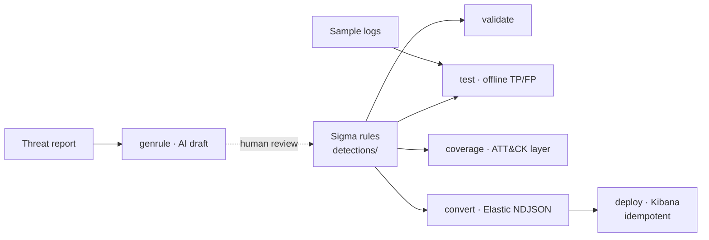

# sentinel-as-code

**Detection-as-Code for Linux Blue Teams.** Manage [Sigma](https://github.com/SigmaHQ/sigma)
detection rules as code, with automated true-positive / false-positive tests,
conversion to the Elastic Detection Engine, measured MITRE ATT&CK coverage, an
end-to-end CI/CD pipeline, and AI-assisted rule drafting with a human in the loop.

> What sets this apart from a rule dump: **every rule ships with an automated
> TP/FP test**, ATT&CK coverage is **measured as a percentage**, and the cycle
> is **automated end to end**. Tests run **offline** — no SIEM required.

<!-- TODO: replace with a demo GIF of `make test` + `make coverage` -->


## Architecture



See [docs/ARCHITECTURE.md](docs/ARCHITECTURE.md) for the full design and rationale.

## Quickstart

```bash
# 1. Install (uv recommended; pip works too)
make install

# 2. Validate every Sigma rule (metadata + ATT&CK tags + pySigma validators)
make validate

# 3. Run the offline TP/FP test suite — no Elasticsearch needed
make test

# 4. Measure MITRE ATT&CK coverage (writes coverage/ artifacts)
make coverage

# 5. Convert rules to Elastic Detection Engine NDJSON (build/elastic/)
make convert
```

To publish to a local SIEM:

```bash
make up                                  # start Elasticsearch + Kibana (single node)
cp config/elastic.example.env .env       # fill in URL + credentials, then:
set -a && source .env && set +a
make deploy                              # idempotent upsert into Kibana
```

> Requires Python 3.12+. `make up`/`make deploy` need Docker; everything else
> (validate / test / coverage / convert) runs without it.

## Current coverage

6 rules across 6 ATT&CK tactics:

| Tactic | Technique | Rule |
|--------|-----------|------|
| Execution | T1059.004 | Remote payload piped to a shell (`curl … \| bash`) |
| Persistence | T1098.004 | `~/.ssh/authorized_keys` modified via redirection |
| Credential Access | T1003.008 | Sensitive read of `/etc/shadow` |
| Defense Evasion | T1070.003 | Shell command history cleared/disabled |
| Privilege Escalation | T1548.001 | SUID/SGID bit set on a binary via `chmod` |
| Discovery | T1033 / T1082 | Local system & user reconnaissance burst |

Regenerate the numbers any time with `make coverage`
([coverage/coverage_summary.md](coverage/coverage_summary.md), plus an ATT&CK
Navigator layer you can import at [mitre-attack.github.io/attack-navigator](https://mitre-attack.github.io/attack-navigator/)).

## Adding a rule

Write the Sigma rule, add a TP/FP log pair, then `make validate && make test`.
The full walkthrough is in [docs/ADDING_A_RULE.md](docs/ADDING_A_RULE.md). The
log schema is documented in [docs/LOG_SCHEMA.md](docs/LOG_SCHEMA.md).

## AI-assisted drafting (human in the loop)

```bash
make genrule REPORT=threat-report.txt
```

This drafts a rule + TP/FP logs into `drafts/`, validates them, and **never**
merges or deploys. A human reviews and promotes. Provider is pluggable (Google
Gemini via `GEMINI_API_KEY`, or an offline template fallback) — see
[docs/AI_RULE_GENERATION.md](docs/AI_RULE_GENERATION.md).

## CLI / Makefile

Every `make` target maps 1:1 to a `sentinel` subcommand:

| Command | Does |
|---------|------|
| `make validate` | Validate all Sigma rules |
| `make test` | Offline TP/FP detection tests |
| `make coverage` | ATT&CK Navigator layer + Markdown summary |
| `make convert` | Sigma → Elastic NDJSON |
| `make deploy` | Idempotent publish to Kibana |
| `make genrule REPORT=<file>` | AI rule draft (human-reviewed) |
| `make up` / `make down` | Start / stop Elasticsearch + Kibana |
| `make lint` / `make fmt` / `make typecheck` | Code quality |

## CI/CD

* **CI** (`.github/workflows/ci.yml`, on PR): ruff, yamllint, `validate`,
  `test`, `pytest`, `coverage`; uploads the coverage summary as an artifact.
* **CD** (`.github/workflows/cd.yml`, on push to `main`): `convert` + `deploy`
  using `ELASTIC_URL` / `ELASTIC_API_KEY` from GitHub Secrets.

## License

[MIT](LICENSE).
