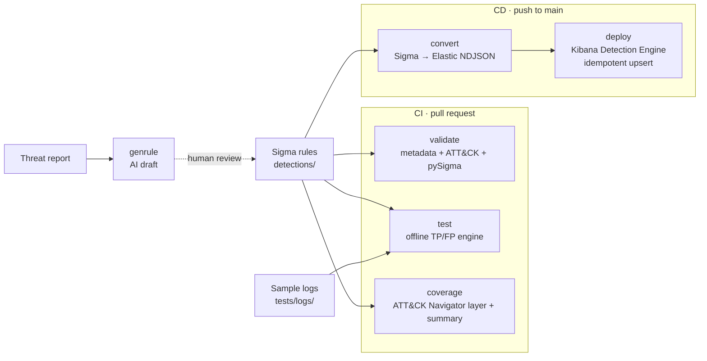

# Architecture

sentinel-as-code is a **Detection-as-Code** platform: Sigma rules are the
source code, and everything else — tests, SIEM rules, coverage, deployment — is
derived from them by a reproducible toolchain.

## Pipeline

## Components

| Module | Responsibility |
|--------|----------------|
| `rules.py` | Load/parse Sigma, define required metadata, validate (single source of truth for "what a valid rule is"). |
| `engine/base.py` | `DetectionEngine` interface: `evaluate(rules, log_file) -> set[rule_id]`. |
| `engine/python_engine.py` | Default offline evaluator — walks the pySigma AST against ECS JSON. No Docker. |
| `engine/zircolite_engine.py` | Production-grade offline evaluation via Zircolite in Docker (same interface). |
| `convert.py` | Sigma → Elastic Detection Engine NDJSON (Lucene), preserving title/description/severity/ATT&CK. |
| `coverage.py` | Aggregate techniques → ATT&CK Navigator layer + Markdown summary with per-tactic %. |
| `deploy.py` | Idempotent publish to Kibana (upsert by `rule_id`); credentials from env only. |
| `genrule.py` | Pluggable `AIProvider` (Gemini + offline template) → draft rule in `drafts/`, never auto-merged. |
| `cli.py` | `typer` CLI; each subcommand mirrors a Makefile target. |

## Design principles (and where they live)

1. **Single source of truth** — the Sigma rule. NDJSON is derived, never hand
   edited (`convert.py`).
2. **Tests decoupled from the SIEM** — the suite runs against local logs with no
   Elastic up (`engine/python_engine.py`, default for `make test`).
3. **Separation of concerns** — modules talk only through small interfaces
   (`DetectionEngine`, `AIProvider`).
4. **Idempotent deploy** — upsert keyed on the Sigma UUID (`deploy.py`).
5. **AI with a human in the loop** — drafts land in `drafts/`, validated but
   never published (`genrule.py`, see [AI_RULE_GENERATION.md](AI_RULE_GENERATION.md)).
6. **Secret hygiene** — credentials only via env / GitHub Secrets; only
   `*.example` files in the repo.
7. **Reproducibility** — pinned deps, `Makefile`, containerizable stack.

## Why these choices

* **Offline-first testing.** A pure-Python engine keeps the inner loop fast and
  CI lightweight; Zircolite is available behind the same interface for
  higher-fidelity evaluation when Docker is present.
* **Elastic as the target SIEM.** Open-source with a native detection engine and
  a clean import API, so idempotent deploys are straightforward.
* **ECS everywhere.** Rules and sample logs both use ECS, so the offline tests
  exercise the same field names production telemetry uses.
